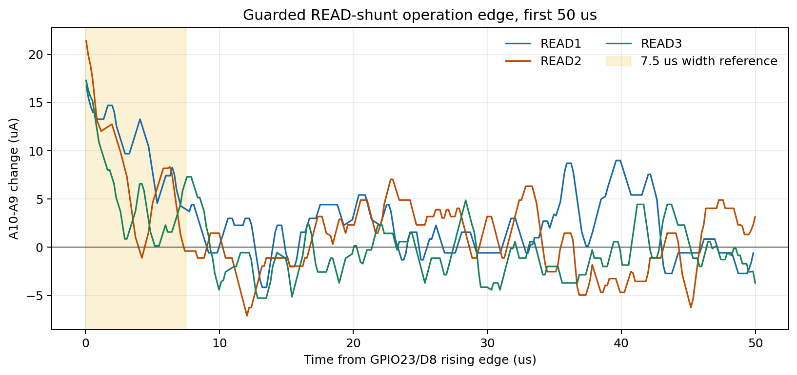
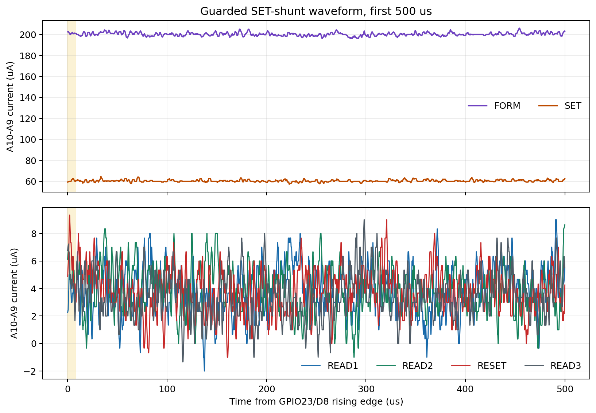
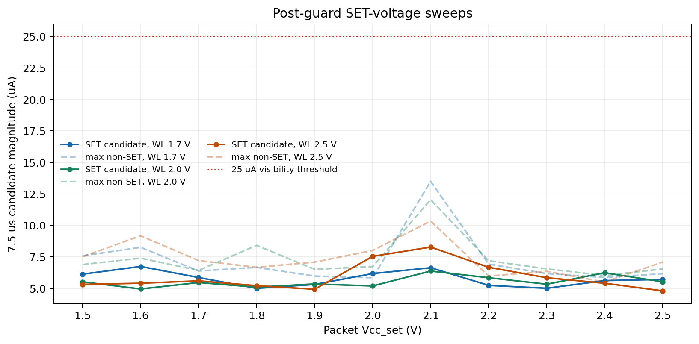
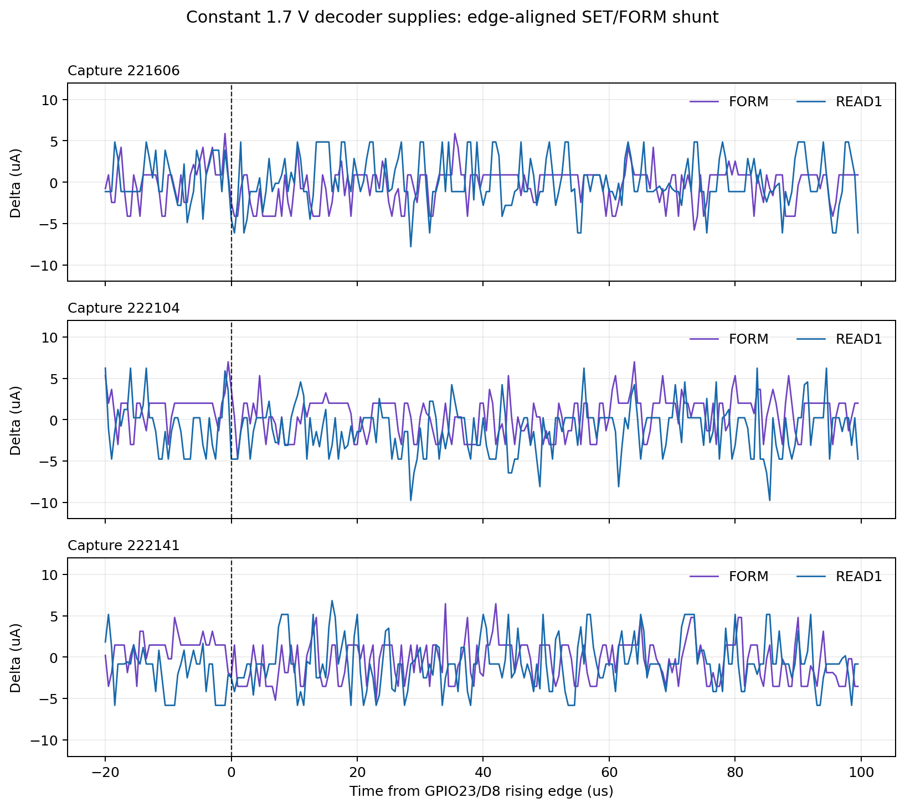

# Post-DAC-guard current-pulse experiments

Date: 2026-08-08

## Scope

This README consolidates the hardware measurements and supporting simulations performed after the 5 ms DAC guard was inserted. Data captured before that change is intentionally excluded.

The question was whether the external decoder-driver shunts show a current increase during the 15-clock FORM, READ, SET, or RESET array pulse that the ADS1258 may be too slow to resolve.

## Common setup

| Item | Setting |
|---|---|
| Caravel clock | 2 MHz |
| Nominal pulse | 15 clocks = 7.5 us |
| Packet order | `CONFIG once -> FORM -> READ1 -> SET -> READ2 -> RESET -> READ3` |
| CONFIG words | `0x00036472`, `0x462B000B`, `0x44001405` |
| Operation words | `0x900888FF`, `0x500888FF`, `0xD00888FF`, `0x500888FF`, `0x100888FF`, `0x500888FF` |
| Saleae synchronization | Caravel GPIO23 on D8 |
| Analog measurement | Saleae A10-A9 across a 1 kOhm shunt |
| Conversion | 1 mV differential = 1 uA |
| ADS1258 | Powered off for the post-guard pulse captures |

The operation marker protocol was:

```text
Caravel presents MODE
  -> Teensy applies the packet DAC
  -> Teensy waits 5 ms
  -> Teensy records baseline and asserts ADC_READY
  -> Caravel raises GPIO23 / Saleae D8
  -> Caravel waits the firmware guard and writes the operation packet
  -> monitor interval ends
  -> Caravel lowers D8 and returns MODE to IDLE
```

Thus, D8 marks the operation interval after DAC settling. MODE and DAC changes can still advance even when an operation remains queued in the on-chip Wishbone FIFO, so six correct D8 windows do not by themselves prove six FSM dispatches.

The operation packets used in these runs select RTL row 8, column 0. They do not select row 8, column 8 because the column field `[24:20]` is zero.

## Result summary

| Experiment | Measured path | Main observation | 7.5 us pulse conclusion |
|---|---|---|---|
| Guarded READ capture | A2/A3 READ shunt | D8-edge increases of 17.285-23.885 uA | Edge-correlated features are only 0.96-2.72 us wide, so they are not confirmed 15-clock READ pulses |
| Corrected SET-shunt capture | A0/A1 SET/FORM shunt | FORM starts near 201 uA; SET starts near 61 uA; other windows stay near 4 uA | Sustained and relaxing SET-path current is present, but no isolated 7.5 us SET pulse is resolved |
| SET VCC sweeps, WL rails 1.7/2.0/2.5 V | A10-A9, documented as A2/A3 in the sweep report | SET candidates remain 4.79-8.27 uA, comparable to non-SET candidates | No SET-specific pulse appears from packet `Vcc_set=1.5-2.5 V` |
| Constant packet rails, three repeats | A0/A1 SET/FORM shunt | Short-window excursions are 2-4 uA with 3.08-3.49 uA pre-edge noise | No repeatable FORM pulse and no delayed FORM pulse in READ1 |
| RTL and full-Caravel simulation | Digital decoder selection | Dispatched FORM/SET/RESET operations have 15 valid selected clocks | Available loose RTL produces the intended 7.5 us event; hardware absence is not explained by decoder overlap |

## 1. Guarded READ-shunt capture

Supplies were `Vcc_read=1.7 V`, `Vcc_set=0 V`, and `Vcc_reset=0 V`; all three `Vcc_wl_*` rails remained at 1.7 V. A10/A9 was connected in parallel with ADS1258 A2/A3 on the READ shunt. The Saleae analog rate was 6.25 MS/s.

| Window | Pre-D8 baseline | Maximum in first 30 us | Increase | Half-height width | Mean increase, first 7.5 us |
|---|---:|---:|---:|---:|---:|
| READ1 | 126.591 uA | 147 uA | 20.409 uA | 2.72 us | 10.346 uA |
| READ2 | 50.115 uA | 74 uA | 23.885 uA | 0.96 us | 7.758 uA |
| READ3 | 77.715 uA | 95 uA | 17.285 uA | 1.12 us | 5.477 uA |



The yellow band is a 7.5 us width reference from D8, not an assertion of the internal FSM launch time. The three traces contain a repeatable D8-edge excursion, but it decays faster than the nominal 7.5 us array pulse. GPIO coupling, packet-launch activity, or another operation-edge transient remain possible causes. It is recorded as a candidate, not as a measured READ-cell pulse.

Artifact:

`/home/ubuntu-24-04/saleae-api/captures/sync-control-configonce-form-rsrr-2mhz-adcoff-wl1p7-packet-read1p7-setreset0-operationonly-deadtime5ms-clean-20260808-190704`

## 2. Corrected SET/FORM-shunt capture

A10/A9 was moved to ADS1258 A0/A1, the logical SET/FORM shunt. Packet supplies were `Vcc_set=1.5 V` during FORM and SET, `Vcc_read=0 V`, and `Vcc_reset=0 V`. All `Vcc_wl_*` rails stayed at 1.7 V. The analog rate was 6.25 MS/s.

| Window | Pre-D8 level | First-100 us behavior | Observation |
|---|---:|---:|---|
| FORM | 203.431 uA | mean 200.669 uA | Starts near 201 uA and relaxes over milliseconds |
| SET | 60.757 uA | mean 60.521 uA | Broad SET-path current, later settling near 50-55 uA |
| READ1 | 4.458 uA | near baseline | SET supply is off |
| READ2 | 4.509 uA | near baseline | SET supply is off |
| RESET | 4.366 uA | near baseline | SET supply is off |
| READ3 | 4.138 uA | near baseline | SET supply is off |



The SET mean change in the first nominal 7.5 us was `-0.012 uA` relative to the pre-D8 level. The path clearly carries current in FORM and SET modes, but the measured signature is a sustained level with slow relaxation rather than a separate 15-clock peak.

Artifact:

`/home/ubuntu-24-04/saleae-api/captures/sync-control-configonce-form-rsrr-2mhz-adcoff-wl1p7-setshunt-a0a1-packet-set1p5-readreset0-operationonly-deadtime5ms-20260808-191634`

## 3. Packet Vcc_set sweeps

The packet-side `Vcc_set` was swept from 1.5 V to 2.5 V in 0.1 V steps. Each point captured all six operation windows with a 5 ms DAC guard. Saleae ran at 1.5625 MS/s analog and 6.25 MS/s digital, giving about 12 analog samples across 7.5 us.

| Vcc_set | SET candidate, WL 1.7 V | SET candidate, WL 2.0 V | SET candidate, WL 2.5 V |
|---:|---:|---:|---:|
| 1.5 V | 6.119 uA | 5.509 uA | 5.307 uA |
| 1.6 V | 6.733 uA | 4.943 uA | 5.398 uA |
| 1.7 V | 5.852 uA | 5.455 uA | 5.587 uA |
| 1.8 V | 4.994 uA | 5.087 uA | 5.205 uA |
| 1.9 V | 5.303 uA | 5.341 uA | 4.920 uA |
| 2.0 V | 6.167 uA | 5.184 uA | 7.534 uA |
| 2.1 V | 6.631 uA | 6.367 uA | 8.273 uA |
| 2.2 V | 5.227 uA | 5.833 uA | 6.667 uA |
| 2.3 V | 5.000 uA | 5.322 uA | 5.833 uA |
| 2.4 V | 5.608 uA | 6.229 uA | 5.398 uA |
| 2.5 V | 5.701 uA | 5.511 uA | 4.792 uA |



No sweep reaches the 25 uA visibility threshold, and the largest non-SET candidates are 13.487, 12.040, and 10.335 uA for WL rails of 1.7, 2.0, and 2.5 V respectively. Raising the WL rails does not reveal a SET-specific pulse.

Important wiring limitation: the sweep report identifies A10-A9 as the ADC A2/A3 shunt path. Therefore these sweeps are evidence that no SET-window pulse appeared on that monitored path; they are not direct SET-shunt amplitude measurements. The direct SET-path evidence is experiment 2 on A0/A1.

An additional per-window analysis repeat produced SET candidates from 4.574 to 6.949 uA and a maximum candidate of 10.862 uA in any window. Its artifact script did not independently record the static WL setting, so it is retained as supporting repeatability data rather than merged into the three rail comparisons.

Full point-by-point data:

- [WL 1.7 V CSV](post_dac_guard_waveforms/data/set-vcc-skew-20260808-summary.csv)
- [WL 2.0 V CSV](post_dac_guard_waveforms/data/set-vcc-skew-wl2v-20260808-summary.csv)
- [WL 2.5 V CSV](post_dac_guard_waveforms/data/set-vcc-skew-wl2p5v-20260808-summary.csv)
- [Per-window repeat CSV](post_dac_guard_waveforms/data/set-vcc-skew-scanfix-20260808-summary.csv)

Remote capture families:

```text
/home/ubuntu-24-04/saleae-api/captures/set-vcc-skew-20260808-setXXXX
/home/ubuntu-24-04/saleae-api/captures/set-vcc-skew-wl2v-20260808-setXXXX
/home/ubuntu-24-04/saleae-api/captures/set-vcc-skew-wl2p5v-20260808-setXXXX
/home/ubuntu-24-04/saleae-api/captures/set-vcc-skew-scanfix-20260808-setXXXX
```

## 4. Constant decoder-supply FORM-gap-READ1 test

This test removed MODE-driven DAC switching completely. `Vcc_set`, `Vcc_reset`, `Vcc_read`, and all three `Vcc_wl_*` rails were held at 1.7 V. The SET/FORM shunt was measured at 6.25 MS/s analog and 250 MS/s digital.

The sequence was `CONFIG once -> FORM -> long gap -> READ1`. D8 starts were 60.318 ms apart: FORM was high for 40.706 ms, followed by 19.612 ms low before READ1. No DAC write occurred during either D8 window or the gap.

| Run | FORM pre-D8 | READ1 pre-D8 | FORM 2-9.5 us delta | READ1 2-9.5 us delta | Largest local FORM feature | Largest local READ1 feature |
|---|---:|---:|---:|---:|---:|---:|
| 221606 | 48.120 uA | 34.140 uA | -2.418 uA | -1.012 uA | +3.457 uA at 395.930 us | +3.745 uA at 322.458 us |
| 222104 | 47.013 uA | 32.776 uA | -0.035 uA | -0.925 uA | +2.234 uA at 295.482 us | +3.553 uA at 276.570 us |
| 222141 | 47.545 uA | 33.841 uA | -1.949 uA | +0.159 uA | +2.394 uA at 348.658 us | +2.979 uA at 343.354 us |



Pre-D8 noise standard deviation was 3.08-3.49 uA. The strongest positive features occur at different offsets in each capture and are accompanied by comparable negative excursions. No repeatable positive FORM pulse is resolved, and there is no evidence that FORM executes later inside the READ1 D8 window. The 13-14 uA lower READ1 baseline is a slow relaxation between windows, not a narrow pulse.

Artifacts:

```text
/home/ubuntu-24-04/saleae-api/captures/fifo-delay-static-rails-form-read1-setshunt-20260808-221606
/home/ubuntu-24-04/saleae-api/captures/fifo-delay-static-rails-form-read1-setshunt-20260808-222104
/home/ubuntu-24-04/saleae-api/captures/fifo-delay-static-rails-form-read1-setshunt-20260808-222141
```

## 5. Simulation and logic investigation

Focused cocotb tests used the exact configuration and operation words against the available loose `top_module_wr` RTL.

- Long-gap traffic acknowledges FORM but does not dispatch it until READ1 writes the following FIFO word. Later operations can remain queued.
- A back-to-back burst dispatches `FORM -> READ -> SET -> READ -> RESET`; the final READ3 remains queued.
- Once dispatched, FORM, SET, and RESET each select row 8, column 0 for all 15 PWM clocks with the correct mux and BL/SL polarity.
- The focused regression passes 9/9 tests, including corrected row-8/column-8 addressing and direct scan selection.
- Full-Caravel cocotb, including management firmware and user Wishbone, also shows one FORM dispatch after READ1 and 15/15 valid FORM-drive clocks. At 2 MHz this is 7.5 us.
- Direct scan word `0xA108` statically selects WL8/SL8/BL8 with SET polarity and mux `00`, bypassing Wishbone, FIFO, FSM, and PWM timing.

The FIFO behavior explains why mux/DAC activity can look correct while cell operations do not correspond one-for-one with the labeled windows: MODE GPIOs drive the external control sequence independently of command dispatch inside the macro.

The checked-in `Neuromorphic_X1_wb` GDS is only an abstract with met2/met3 pins and obstructions. Signoff black-boxed the macro, found zero internal devices, and therefore did not validate the fabricated decoder driver, rail connection, or array path. The loose RTL cannot rule out a taped-hard-macro or physical connectivity problem.

Simulation artifacts:

- `TEST_Bench/caravel_actual_rtl_cocotb/tests/test_top_module_wr_packet_select.py`
- `TEST_Bench/caravel_full_cocotb/user_proj_tests/form_gap_read1_probe`
- Full-Caravel passing tag: `codex_form_gap_read1_probe_08_Aug_final2`

## Conclusion

The DAC guard successfully isolates packet activity from DAC settling. After that correction, no repeatable 7.5 us current pulse is resolved on the measured shunts.

The hardware does show meaningful path behavior: READ has a short D8-edge excursion, and the corrected SET shunt carries large sustained FORM/SET current. Neither signature matches an isolated 15-clock pulse. Constant decoder supplies and repeated captures further reduce the likelihood that DAC switching or Saleae timing hid such a pulse.

The available RTL produces the required 15-clock decoder overlap after a command dispatches, but the Wishbone FIFO can delay or stall commands, and the repository cannot simulate the internal taped hard macro. The most decisive next hardware isolation is the direct-scan static selection while monitoring the SET/FORM shunt, followed by a packet run using the intended column field and access to the actual submitted hard-macro GDS or extracted netlist.

## Local waveform files

The plotted CSV derivatives and the reproducible plotting script are in [post_dac_guard_waveforms](post_dac_guard_waveforms/). The raw Saleae `.sal` files remain in the remote artifact directories listed above.
